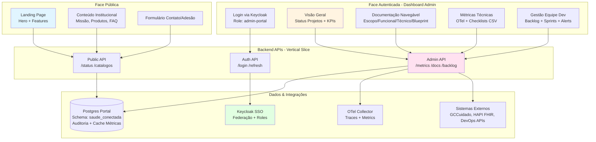

# Portal Saúde Conectada — Documento de Referência

## 1) Escopo e Abrangência
- Objetivo: Portal dual com **face pública** (landing page institucional, divulgação, venda da solução) e **face autenticada** (dashboard executivo para administradores com documentação consolidada, métricas de evolução do projeto e gestão da equipe de desenvolvimento).
- Abrangência:
  - **Público**: páginas institucionais, apresentação de produtos/serviços, adesão/contato.
  - **Autenticado (Admin)**: dashboard com métricas do projeto (checklists de aderência, status de sprints, KPIs técnicos), navegação completa da documentação (Estudos e Direcionamentos + Documentação estruturada), ferramentas de interação com a equipe dev (tickets, backlog, alertas).
- Público-alvo: Cidadãos e parceiros (público); Gestores de Projeto, Product Owners, CTO (autenticado).

## 2) Especificação Funcional

### Face Pública
- **Landing Page**: hero section, features, depoimentos, CTA (call-to-action) para contato/adesão.
- **Conteúdo Institucional**: missão, produtos (CarePlanner, ConectaRede, IntelliCare MCP), casos de uso, FAQ.
- **SEO e Acessibilidade**: meta tags, structured data, WCAG AA, performance otimizada.

### Face Autenticada (Dashboard Admin)
- **Visão Geral do Projeto**: cards com status geral (CarePlanner/ConectaRede/IntelliCare MCP), progresso de checklists consolidados (CSV), alertas de bloqueios.
- **Documentação Navegável**: acesso estruturado aos docs (Escopo, Funcional, Técnico, Blueprint) por projeto; busca full-text; versionamento.
- **Métricas Técnicas**: integração com OTel/dashboards (uptime, latência p95, cobertura de testes, debt técnico).
- **Gestão de Equipe Dev**: visualização de backlog (integração com Azure DevOps/Jira ou similar), status de sprints, alocação de pessoas, retrospectivas.
- **Interação**: comentários em docs, notificações de mudanças críticas, export de relatórios executivos (PDF/Excel).

### Integrações
- APIs públicas (status, catálogos) para face pública.
- APIs autenticadas (métricas, docs, backlog) via JWT para dashboard admin.

## 3) Especificação Técnica
- **Stack Alvo**: .NET 10, Blazor WebAssembly + MudBlazor (UI responsivo, componentes de dashboard: grids, charts, cards), Minimal APIs agrupadas por Feature (Vertical Slice), .NET Aspire (AppHost/ServiceDefaults) para orquestração em dev.
- **Autenticação e Autorização**:
  - **Público**: sem autenticação; rate limiting por IP.
  - **Admin**: Keycloak SSO com role `admin-portal`; JWT validado em todas as APIs autenticadas; refresh tokens para sessões longas.
- **Modelo de Dados**:
  - Postgres auxiliar para logs de auditoria, cache de métricas agregadas, histórico de docs.
  - Schema: `saude_conectada` - Centraliza todo o controle do portal
  - Integração read-only com bases principais (GCCuidado, HAPI FHIR) via APIs.
- **Segurança & LGPD**:
  - TLS obrigatório; segredos via Azure Key Vault ou equivalente.
  - CORS configurado (público: amplo; autenticado: restrito a domínios conhecidos).
  - Mascaramento de PII em logs; retenção de 90 dias para métricas não-críticas.
  - Banner de consentimento para cookies analytics (face pública).
- **Entrega/Infra**:
  - Build estático (WASM) servido por CDN (Azure Static Web Apps ou equivalente).
  - APIs containerizadas (Docker) com deploy via CI/CD (GitHub Actions ou Azure Pipelines).
  - Feature flags (LaunchDarkly ou similar) para habilitar dashboard/features por ambiente.
- **Observabilidade**: OpenTelemetry (traces/metrics end-to-end), HealthChecks (`/healthz` valida deps), dashboards Grafana/Azure Monitor (uptime, latência, erros 4xx/5xx).

## 4) Blueprint

### Arquitetura de Alto Nível

### Componentes

#### Frontend
- **Portal.Wasm** (Blazor WASM + MudBlazor):
  - Rotas públicas: `/`, `/sobre`, `/produtos`, `/contato`.
  - Rotas autenticadas: `/dashboard`, `/dashboard/docs/{projeto}`, `/dashboard/metricas`, `/dashboard/equipe`.
  - Componentes reutilizáveis: `ProjectStatusCard`, `ChecklistProgressBar`, `DocNavigator`, `TeamBacklog`.

#### Backend
- **Portal.Api** (Minimal APIs por Feature):
  - `Features/Public`: endpoints `/status`, `/catalogos`, `/contato` (POST).
  - `Features/Admin/Metrics`: `/api/admin/metrics/overview`, `/api/admin/metrics/{projeto}`.
  - `Features/Admin/Docs`: `/api/admin/docs`, `/api/admin/docs/{projeto}/{arquivo}`.
  - `Features/Admin/Team`: `/api/admin/backlog`, `/api/admin/sprints`.
  - `Features/Auth`: `/api/auth/login`, `/api/auth/refresh`, `/api/auth/logout`.

#### Infraestrutura
- **Keycloak**: realm `saude-conectada`, client `portal-admin`, role `admin-portal`.
- **Postgres**: schema `saude_conectada` com tabelas `audit_log`, `cached_metrics`, `doc_versions`.
- **OTel**: exporter para Azure Monitor ou Grafana; correlation-id propagado end-to-end.
- **Feature Flags**: `dashboard-enabled`, `team-backlog-enabled`, `external-devops-integration`.

### Integrações
- **CarePlanner/ConectaRede/IntelliCare MCP**: consumo read-only de métricas via APIs autenticadas (OTel metrics endpoint ou custom).
- **Azure DevOps/Jira** (opcional): API para buscar backlog/sprints/burndown.
- **GitHub** (opcional): API para buscar PRs, commits, pipeline status.

### Roadmap
1. **MVP Público**: landing page + conteúdo institucional + SEO.
2. **MVP Autenticado**: login + dashboard overview + checklists CSV display.
3. **Documentação Navegável**: integração com docs estruturados + busca.
4. **Métricas Técnicas**: integração OTel + charts interativos.
5. **Gestão de Equipe**: integração DevOps + backlog/sprints + notificações.

